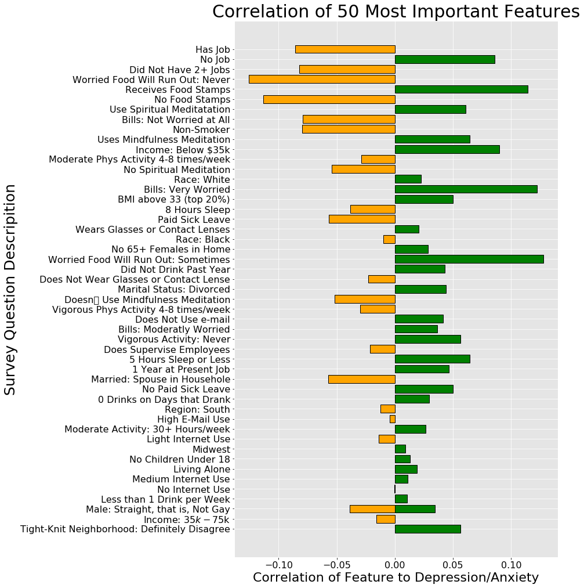

**Important Documents**

Presentation in pdf format:
presentation.pdf

Main code notebook:
student.ipynb

**Related links for this project:**

Blog Post:
<https://terryollila.github.io/repetitive_model_fitting_in_classification>

Video Presentation:
<https://vimeo.com/389112659>

# Premise

This analysis will explore a dataset from the 2017 National Health Interview Survey (NHIS) provided to the public by the Center for Disease Control and Prevention (CDC). The purpose is to create a means of predicting mental illness of debilitating depression and anxity based on numerous societal, personal, and economic factors as submitted by the American public to the CDC.

The survey itself consists of responses from 26,000 individual adults, who are the only targets in scope for this report. Only a fraction of these records will be used as classifying something as granular as mental illness will necessetate a paring down of the original data set.

The target variable in this report is an adult individual's diagnose depression and anxiety as classified as mentall illness severe enough to imare activities.

This report is not intended to be used as a guide for avoiding or relieving mental illness, but as a tool to identify potential warning signs and to investigate societal, economic, and lifestyle factors.

# Conclusions

## Summary

There were five models generated for the target data of individuals classified as having dibilitating depression or anxiety. The decision tree was the first, as it was an easy model from which to pull robust metrics and visuals. The results were fine but not fantastic. The next model was the random forest, which definitely improved the output figures. A natural progression led to the XGBoost model, which made further improvments still. It was followed up with the Support Vector Classifier, which was the model I identified for the best model for my purposes. After that came the K Nearest Neighbors model, which actually had a higher accuracy, but the the AUC was higher on the SVC, and recall was superior, which I felt was important in maximizing positive hits as opposed with avoiding false positives. Better to capture as many at-risk individuals as possible.

As for the final output, I had an accuracy value of .74 with the Support Vector Classifier. This model was able to create a definite prediction regarding debilitating depression and anxiety. True positive and true negative values relative to their false counterparts were both nearly 75%. The f1 score was also superior to the other models at 12.6, which sounds terrible but it was a very small target in comparison with the overall sample. While there were a sizeable number of false positives, the model caught the majority of mentally ill individuals.

With some strong tools and enough data, mental illness, and depression and anxiety in particular, can be predicted to a fairly strong extent based on economic factors and personal lifestyles. While it can't necessarily be ascertained which causes which -- whether, for example, individuals have difficulty maintaining employment because they have debilitating depression and/or anxity or if they have debilitating depression and/or anxity because they are unemployed -- that distinction does not necessarily matter. While more research would need to be done to investigate and dissect unique factors (such as unemployment or poverty), a report such as this can be used as a tool to assist in determining which features to pursue, as well as carving out segments of the popoulation that are more likely to be at risk and allocating budgets for mental health intervention appropriately.

Further, because so many of the most important factors were economic in nature, it may be indicative of the need to address poverty issues one way or another. Whether poverty causes debilitating depression and anxiety or depression and anxiety cause poverty is beside the point; the reality is that these forms of mental illness exist under those circumstances, for one reason or another, and should be addressed accordingly.

Though I am includeing below the top 50 most important features used in identifying debilitating depression and anxiety in this report, the individual variables should not be used on their own to make judgments about any particular aspect, especially if the correlation is close to center. This report is the culmination of 100 separate variables, and there is planty of margin for error in the details. For example, black race shows just left of center as being at less risk for debilitating depression and anxiety, while white race shows just to the right as being slightly more at risk for debilitating depression and anxiety. This is not an argument that racial injustice has been alleviated and people with African heritage have finally reached parity with those of Eurpoean heritage. The only question this report is equipped to answer is who is more at risk for debilitating depression and anxiety; any other arguments about relative happiness or well being are far beyong the scope of the data herein.

## Recommendations

There are two important things to consider given these conclusions. One is that we can identify those individuals who are most at risk for debilitating depression and anxiety, especially those in low economic status. This can guide decision-makers in allocating mental health resources to those areas most in need. The other side is that, knowing that poverty plays some part in these diseases, find the means to alleviate that poverty in our society.

## Important Feature Plot


```python
# Put the target together with the original dummy set to establish correlation
# for plotting.
corr_dummies = pd.concat([you_dummies[best_features_rfc.index[:50]], 
                          test_target], axis = 1)
corr_dummies = corr_dummies.corr()
corr_dummies['to_sort'] = abs(corr_dummies['AFLHCA17'])
# Take everything but the target.
to_sort_df = corr_dummies[['AFLHCA17', 'to_sort']][:-1]
# Reverse the order for sorting
to_sort_df = to_sort_df.iloc[::-1]
plot_labels = [labels[x] for x,y in to_sort_df.iterrows()]
```


```python
# I'd like to have different colors for pos vs neg.
to_sort_df['positive'] = to_sort_df['AFLHCA17'] > 0
fig = plt.figure(figsize=(10, 17))
ax = fig.add_subplot(111)
fig.patch.set_facecolor((0,0,0,0))

# plot_labels was established early in the exploration when using most 
# important features to guide modeling.
plt.barh(plot_labels, to_sort_df['AFLHCA17'], 
         color=to_sort_df.positive.map({True: 'green', False: 'orange'}), 
                                        edgecolor='black', lw=1)
plt.title('Correlation of 50 Most Important Features', color='black', fontsize=30)
# ax.xaxis.label.set_color('white')
# ax.yaxis.label.set_color('white')
ax.tick_params(axis='x', colors='black', labelsize=16)
ax.tick_params(axis='y', colors='black', labelsize=16)
plt.xlabel('Correlation of Feature to Depression/Anxiety', color='black', 
           fontsize=22)
plt.ylabel('Survey Question Descripition', color='black', fontsize=25)
plt.show()
```




